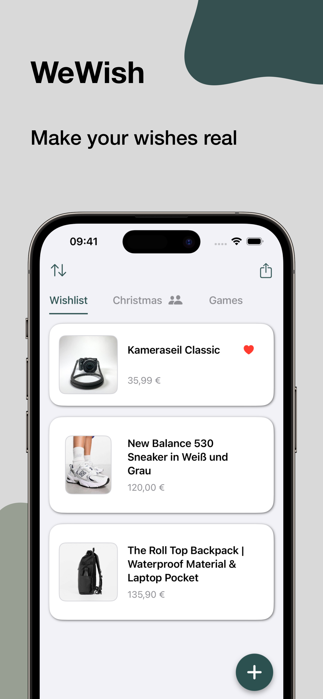
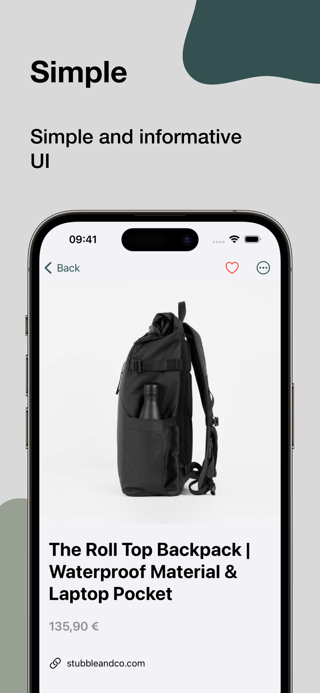
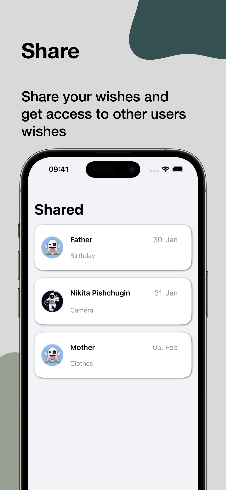
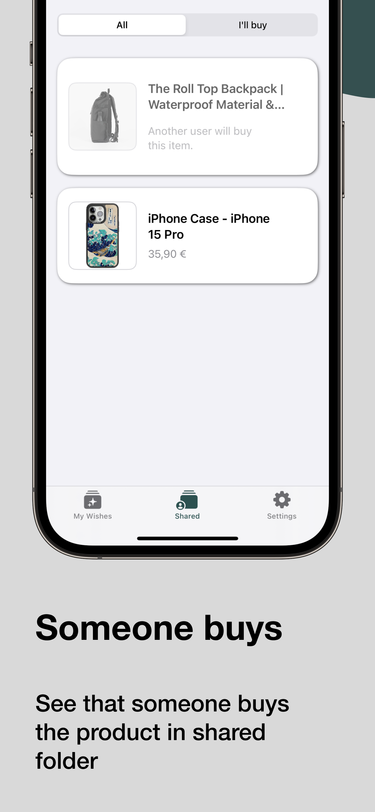
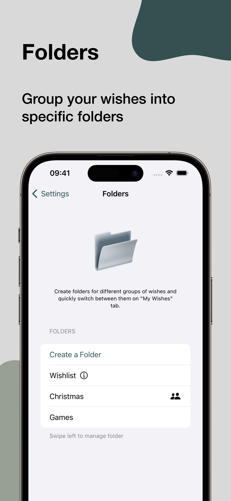

# WeWish: Share your wishes
WeWish - my latest and most advanced project.  
Discover the power of WeWish, the must-have app that transforms your dreams into reality! Whether it's your birthday, a special occasion, or just because, this intuitive wish list app is here to make sure your wishes are heard and fulfilled.

AppStore: https://apple.co/3RWl0Jq

## Stack
- Swift
- SwiftUI
- UIKit
- CoreData
- CloudKit
- PDFKit
- RevenueCat
- Firebase.

## Features
### Free
- unlimited amount of wishes
- sync between your Apple iPhones and iPad with the same AppleID (CloudKit sync)
- adding products directly to the app from any website (Share Extension and App Groups)
- share your wishes with anyone by sending a PDF (PDFKit)
- access the wishes that are shared with you (CloudKit)

### Subscription
- share your wishes with other users of the app (CloudKit)
- create folders for different kinds of wishes

## Compatibility
- iPhone running on iOS 17 or later 
- iPad running on iPadOS 17 or later 

## Previews

  
  
  
  
  

